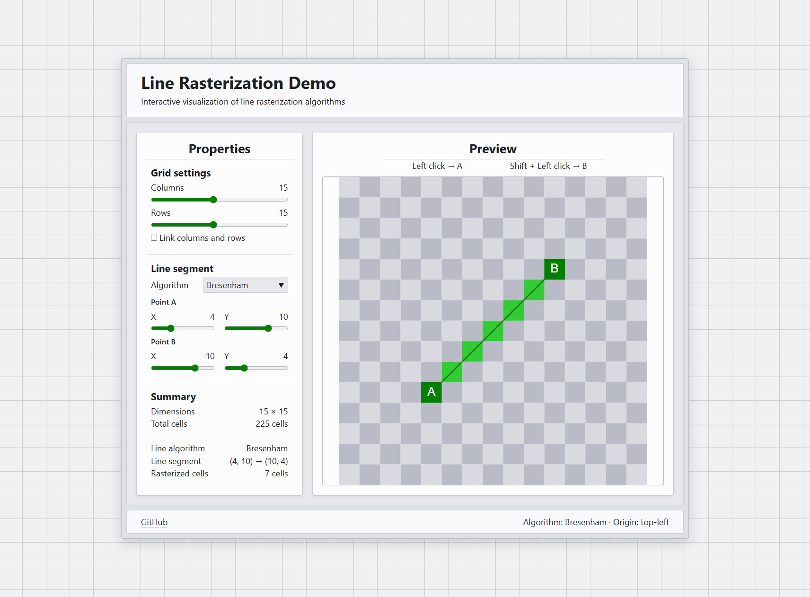

# Line Rasterization Demo

An interactive application for visualizing how line-drawing algorithms select cells on a grid. The current version focuses on Bresenham's line algorithm, with more algorithms planned.

[View the live demo](https://tordloefgren.github.io/LineRasterizationDemo/)



## About

Users can configure the grid, position the line endpoints with sliders or direct canvas interaction, and see the rasterized result update immediately.

I am building this project to strengthen my frontend development skills through a concrete technical problem. It also serves as groundwork for a future occupancy-grid application, where line rasterization can be used for grid-based ray casting.

The first version uses vanilla HTML, CSS, and TypeScript so I can work directly with the web platform and better understand the problems that frameworks solve. I plan to rebuild the application in Vue after developing the vanilla version further.

## Technical notes

- Rendering, geometry, rasterization, and state-transition logic are separated into modules. This keeps the geometry, rasterization, and state logic testable without the UI.
- State transitions are implemented as pure functions that take the current state and return a new state for rendering.
- The Bresenham implementation is adapted from published all-octants pseudocode; see [References](#references).

## Features

- Configurable grid dimensions
- Optional linking of row and column dimensions
- Line endpoints controlled through sliders or canvas interaction
- Endpoint clamping when the grid shrinks
- Bresenham line rasterization
- Live grid and line-segment summary
- Responsive canvas rendering

## Tech stack

- HTML
- CSS
- TypeScript
- Canvas API
- Vite
- Vitest
- Radix Colors

## Testing

Vitest unit tests cover grid behavior, state transitions, endpoint clamping, and line rasterization across different directions and slopes.

## Requirements

- Git
- Node.js `^20.19.0` or `>=22.12.0`
- npm

## Quick start

```sh
git clone https://github.com/TordLoefgren/LineRasterizationDemo.git
cd LineRasterizationDemo
npm install
npm run dev
```

Open the local URL printed by Vite. To run the unit tests and create a production build:

```sh
npm run test:once
npm run build
```

## Roadmap

- Add more line-rasterization algorithms
- Explore layouts and interaction patterns for different devices
- Audit and improve accessibility
- Expand cross-browser testing
- Rebuild the application in Vue

## References

- **David J. Stahl Jr.** – _reference for adapting the Bresenham implementation_<br />
  ["A Lab Exercise for Rasterizing Lines"](https://diglib.eg.org/handle/10.2312/cgems04-11-1359), Figure 3 (CGEMS / The Eurographics Association, 2008)
